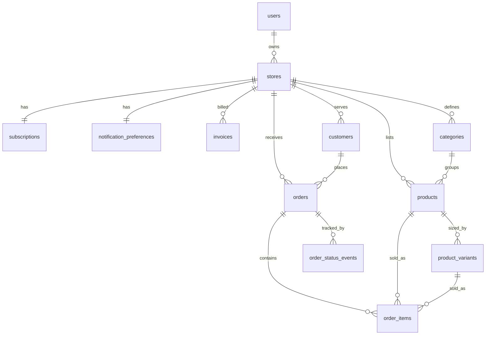

# KasaCart — Postgres Database Schema

This document specifies a PostgreSQL schema that backs the **entire KasaCart system**
as it exists in the UI today: the marketing home page, the seller dashboard
(Dashboard, Orders, Products, Customers, Analytics, Storefront settings, Billing,
Settings) and the public storefront at `/store/[handle]` where customers browse and
place orders.

It is derived directly from the app's TypeScript types (`src/types/*`), the shared
mock data (`src/utils/SampleDate.tsx`) and the page/modal UIs.

---

## 1. System model in one paragraph

KasaCart is a **multi-tenant SaaS for social sellers**. A person signs up (auth via
**Clerk**) and becomes a **seller** who owns one **store**. A store has a brand
(name, handle, tagline, accent colour, logo, banner, WhatsApp number) and a
**subscription** (Free / Pro). Sellers add **products** (each with optional
**size/measurement variants** that carry their own price) grouped into
**categories**. Shoppers visit the public storefront, add items to a cart and check
out, which creates a **customer** and an **order** made of **order items**. The
dashboard reads back orders, customers and **analytics** that are aggregated from
those orders. Sellers also manage **notification preferences** and view **billing
history (invoices)**.



---

## 2. Conventions

| Concern | Decision |
| --- | --- |
| **Primary keys** | `uuid` via `gen_random_uuid()` (from `pgcrypto`). |
| **Tenancy** | Every store-scoped table carries `store_id` with a FK + index. |
| **Timestamps** | `created_at` / `updated_at` as `timestamptz` defaulting to `now()`; `updated_at` maintained by a trigger. |
| **Money** | Stored as **integer pesewas** (1 GHS ₵ = 100 pesewas) to avoid float errors. The UI shows whole cedis (e.g. `₵120` → `12000`). Column suffix `_pesewas`. |
| **Currency** | `currency_code char(3)` defaulting to `'GHS'` (Ghana Cedi). |
| **Emails** | `citext` (case-insensitive). |
| **Colours** | Hex strings (`text` with a format `CHECK`), e.g. accent `#1d4ed8`, product swatch. |
| **Images** | Stored as **URLs** to object storage. The current UI uses in-browser data URLs; production should upload and persist a URL. |
| **Soft delete** | Not used; rely on `ON DELETE CASCADE`/`SET NULL`. Add `deleted_at` later if needed. |

### Extensions

```sql
CREATE EXTENSION IF NOT EXISTS pgcrypto;   -- gen_random_uuid()
CREATE EXTENSION IF NOT EXISTS citext;      -- case-insensitive email / handle
```

### `updated_at` trigger

```sql
CREATE OR REPLACE FUNCTION set_updated_at()
RETURNS trigger AS $$
BEGIN
  NEW.updated_at = now();
  RETURN NEW;
END;
$$ LANGUAGE plpgsql;
```

Attach to each table that has `updated_at` (shown once below; repeat per table):

```sql
-- pattern, applied to users, stores, products, orders, customers, ...
CREATE TRIGGER trg_<table>_updated_at
  BEFORE UPDATE ON <table>
  FOR EACH ROW EXECUTE FUNCTION set_updated_at();
```

---

## 3. Enumerated types

These mirror the unions in the TypeScript types and the fixed option lists in the UI.

```sql
-- Order lifecycle. UI note: the Dashboard labels the first stage "New";
-- the Orders page labels it "Pending". Both map to 'pending' here.
CREATE TYPE order_status AS ENUM (
  'pending', 'confirmed', 'packed', 'delivered', 'cancelled'
);

-- Checkout "Preferred Payment method" + Create Order modal.
CREATE TYPE payment_method AS ENUM (
  'cash_on_delivery', 'mobile_money', 'bank_transfer'
);

-- Orders page "Paid / Unpaid" toggle.
CREATE TYPE payment_status AS ENUM ('unpaid', 'paid', 'refunded');

-- Sales channel (Create Order modal CHANNELS + the storefront itself).
CREATE TYPE sales_channel AS ENUM (
  'storefront', 'whatsapp', 'instagram', 'tiktok', 'facebook', 'snapchat'
);

-- Customers list "via" (how we reach them).
CREATE TYPE contact_method AS ENUM ('phone', 'email');

-- Billing plan tier.
CREATE TYPE plan_tier AS ENUM ('free', 'pro');

CREATE TYPE subscription_status AS ENUM ('active', 'past_due', 'cancelled');
```

---

## 4. Tables

### 4.1 `users` — sellers / account owners

Backs NextAuth (Auth.js) accounts. `password_hash` holds a bcrypt hash for
email+password accounts and is null for Google-only sign-ins. `role` is `USER`
by default; admins are promoted manually.

```sql
CREATE TABLE users (
  id             uuid PRIMARY KEY DEFAULT gen_random_uuid(),
  email          citext NOT NULL UNIQUE,
  password_hash  text,                            -- bcrypt; null for Google-only
  role           user_role NOT NULL DEFAULT 'USER', -- enum: ADMIN | USER
  full_name      text,
  avatar_url     text,
  created_at     timestamptz NOT NULL DEFAULT now(),
  updated_at     timestamptz NOT NULL DEFAULT now()
);
```

### 4.2 `stores` — the storefront + brand

One per seller (the app assumes a single store). `handle` powers `/store/<handle>`.
Brand fields map 1:1 to the dashboard **Storefront** page and `storeProfile`.

```sql
CREATE TABLE stores (
  id            uuid PRIMARY KEY DEFAULT gen_random_uuid(),
  owner_id      uuid NOT NULL REFERENCES users(id) ON DELETE CASCADE,
  name          text NOT NULL,                       -- "Adwoa's Closet"
  handle        citext NOT NULL UNIQUE,              -- "adwoascloset"
  tagline       text,                                -- "Affordable fashion..."
  accent_color  text NOT NULL DEFAULT '#1d4ed8'
                  CHECK (accent_color ~ '^#[0-9a-fA-F]{6}$'),
  logo_url      text,
  banner_url    text,
  whatsapp_phone text,            -- intl, digits only, for wa.me (e.g. 233245550142)
  support_phone  text,            -- Settings → Support phone
  location       text,            -- "Accra, Ghana"
  currency_code  char(3) NOT NULL DEFAULT 'GHS',
  is_published   boolean NOT NULL DEFAULT true,      -- Settings → Close store
  created_at     timestamptz NOT NULL DEFAULT now(),
  updated_at     timestamptz NOT NULL DEFAULT now()
);

CREATE INDEX idx_stores_owner ON stores(owner_id);
```

### 4.3 `notification_preferences` — Settings → Notifications

```sql
CREATE TABLE notification_preferences (
  store_id        uuid PRIMARY KEY REFERENCES stores(id) ON DELETE CASCADE,
  new_order       boolean NOT NULL DEFAULT true,     -- "New order placed"
  low_stock       boolean NOT NULL DEFAULT true,     -- "Low stock alerts"
  new_customer    boolean NOT NULL DEFAULT false,    -- "New customer"
  weekly_summary  boolean NOT NULL DEFAULT false,    -- "Weekly summary"
  low_stock_threshold integer NOT NULL DEFAULT 5,    -- "below 5 in stock"
  updated_at      timestamptz NOT NULL DEFAULT now()
);
```

### 4.4 `subscriptions` — Billing & plan

```sql
CREATE TABLE subscriptions (
  id                   uuid PRIMARY KEY DEFAULT gen_random_uuid(),
  store_id             uuid NOT NULL UNIQUE REFERENCES stores(id) ON DELETE CASCADE,
  plan                 plan_tier NOT NULL DEFAULT 'free',
  status               subscription_status NOT NULL DEFAULT 'active',
  price_pesewas        integer NOT NULL DEFAULT 0,   -- Free = 0, Pro = 9900
  current_period_start date,
  current_period_end   date,
  created_at           timestamptz NOT NULL DEFAULT now(),
  updated_at           timestamptz NOT NULL DEFAULT now()
);
```

### 4.5 `invoices` — Billing history

```sql
CREATE TABLE invoices (
  id              uuid PRIMARY KEY DEFAULT gen_random_uuid(),
  store_id        uuid NOT NULL REFERENCES stores(id) ON DELETE CASCADE,
  subscription_id uuid REFERENCES subscriptions(id) ON DELETE SET NULL,
  amount_pesewas  integer NOT NULL,
  currency_code   char(3) NOT NULL DEFAULT 'GHS',
  status          text NOT NULL DEFAULT 'paid',      -- 'paid' | 'due' | 'void'
  issued_at       timestamptz NOT NULL DEFAULT now(),
  paid_at         timestamptz
);

CREATE INDEX idx_invoices_store ON invoices(store_id, issued_at DESC);
```

### 4.6 `categories` — product grouping

The Create Product modal offers a fixed list (Clothing, Footwear, …). Modelling it as
a per-store table lets each seller curate their own; seed it with the defaults.

```sql
CREATE TABLE categories (
  id         uuid PRIMARY KEY DEFAULT gen_random_uuid(),
  store_id   uuid NOT NULL REFERENCES stores(id) ON DELETE CASCADE,
  name       text NOT NULL,                          -- "Clothing"
  position   integer NOT NULL DEFAULT 0,
  created_at timestamptz NOT NULL DEFAULT now(),
  UNIQUE (store_id, name)
);

CREATE INDEX idx_categories_store ON categories(store_id);
```

### 4.7 `products`

Maps to the Products page card + Create/Edit Product modal. `stock` and `sold` are
product-level (the UI tracks one stock figure even when sizes exist). `base_price` is
optional because a product can be priced entirely by its variants.

```sql
CREATE TABLE products (
  id                  uuid PRIMARY KEY DEFAULT gen_random_uuid(),
  store_id            uuid NOT NULL REFERENCES stores(id) ON DELETE CASCADE,
  category_id         uuid REFERENCES categories(id) ON DELETE SET NULL,
  name                text NOT NULL,                 -- "Blue Summer Dress"
  description         text,
  base_price_pesewas  integer CHECK (base_price_pesewas >= 0), -- null when variant-priced
  stock               integer NOT NULL DEFAULT 0 CHECK (stock >= 0),
  sold                integer NOT NULL DEFAULT 0 CHECK (sold >= 0),
  color               text CHECK (color IS NULL OR color ~ '^#[0-9a-fA-F]{6}$'),
  image_url           text,
  is_active           boolean NOT NULL DEFAULT true,
  created_at          timestamptz NOT NULL DEFAULT now(),
  updated_at          timestamptz NOT NULL DEFAULT now(),
  UNIQUE (store_id, name)        -- Products page keys/edits by name
);

CREATE INDEX idx_products_store ON products(store_id);
CREATE INDEX idx_products_store_category ON products(store_id, category_id);
CREATE INDEX idx_products_store_active ON products(store_id, is_active);
```

> The UI's price label (`₵120 – ₵150`) is **derived** from variants and is not stored.
> See the `product_price_range` view in §6.

### 4.8 `product_variants` — sizes / measurements with their own price

From `ProductVariant` (size + price) in the Create Product modal.

```sql
CREATE TABLE product_variants (
  id            uuid PRIMARY KEY DEFAULT gen_random_uuid(),
  product_id    uuid NOT NULL REFERENCES products(id) ON DELETE CASCADE,
  size          text NOT NULL,                       -- "M", "42", "500ml"
  price_pesewas integer NOT NULL CHECK (price_pesewas >= 0),
  position      integer NOT NULL DEFAULT 0,
  -- stock integer  -- (future) per-variant stock; UI tracks stock at product level today
  created_at    timestamptz NOT NULL DEFAULT now(),
  UNIQUE (product_id, size)
);

CREATE INDEX idx_variants_product ON product_variants(product_id);
```

### 4.9 `customers`

Captured at storefront checkout (first/last name, email, phone, address, city,
region) and listed on the dashboard Customers page. Order count / amount spent /
last-order are **aggregates** (see `customer_stats` view), not stored columns.

```sql
CREATE TABLE customers (
  id                uuid PRIMARY KEY DEFAULT gen_random_uuid(),
  store_id          uuid NOT NULL REFERENCES stores(id) ON DELETE CASCADE,
  first_name        text,
  last_name         text,
  email             citext,
  phone             text,
  preferred_contact contact_method,                  -- Customers list "via"
  address           text,                            -- last-used delivery details
  city              text,
  region            text,
  color             text CHECK (color IS NULL OR color ~ '^#[0-9a-fA-F]{6}$'),
  created_at        timestamptz NOT NULL DEFAULT now(),
  updated_at        timestamptz NOT NULL DEFAULT now()
);

CREATE INDEX idx_customers_store ON customers(store_id);
-- A customer is unique per store by phone and/or email when present.
CREATE UNIQUE INDEX uq_customers_store_phone ON customers(store_id, phone)
  WHERE phone IS NOT NULL;
CREATE UNIQUE INDEX uq_customers_store_email ON customers(store_id, email)
  WHERE email IS NOT NULL;
```

### 4.10 `orders`

The central transaction. Combines the Orders page, the Create/Edit Order modal and the
storefront checkout. Delivery + contact fields are **snapshotted** onto the order so a
later edit to the customer record doesn't rewrite history.

```sql
CREATE TABLE orders (
  id                   uuid PRIMARY KEY DEFAULT gen_random_uuid(),
  store_id             uuid NOT NULL REFERENCES stores(id) ON DELETE CASCADE,
  customer_id          uuid REFERENCES customers(id) ON DELETE SET NULL,
  order_number         text NOT NULL,                -- "KC-2048"
  status               order_status NOT NULL DEFAULT 'pending',
  channel              sales_channel NOT NULL DEFAULT 'storefront',
  payment_method       payment_method,               -- cash_on_delivery | mobile_money
  payment_status       payment_status NOT NULL DEFAULT 'unpaid',  -- Orders "Paid" flag
  subtotal_pesewas     integer NOT NULL DEFAULT 0,
  delivery_fee_pesewas integer NOT NULL DEFAULT 0,
  total_pesewas        integer NOT NULL DEFAULT 0,
  currency_code        char(3) NOT NULL DEFAULT 'GHS',
  -- contact + delivery snapshot (from checkout / Create Order modal)
  customer_name        text,
  customer_phone       text,
  customer_email       text,
  delivery_address     text,
  delivery_city        text,
  delivery_region      text,
  notes                text,
  placed_at            timestamptz NOT NULL DEFAULT now(),
  created_at           timestamptz NOT NULL DEFAULT now(),
  updated_at           timestamptz NOT NULL DEFAULT now(),
  UNIQUE (store_id, order_number)
);

CREATE INDEX idx_orders_store ON orders(store_id);
CREATE INDEX idx_orders_store_status ON orders(store_id, status);
CREATE INDEX idx_orders_store_placed ON orders(store_id, placed_at DESC);
CREATE INDEX idx_orders_customer ON orders(customer_id);
```

> The Orders/Dashboard "item" string (`Blue Summer Dress ×2`) is **derived** from
> `order_items` — see the `order_item_summary` view in §6.

### 4.11 `order_items`

Line items with a snapshot of name / size / unit price at purchase time, so reporting
stays correct even if the product later changes or is deleted.

```sql
CREATE TABLE order_items (
  id                  uuid PRIMARY KEY DEFAULT gen_random_uuid(),
  order_id            uuid NOT NULL REFERENCES orders(id) ON DELETE CASCADE,
  product_id          uuid REFERENCES products(id) ON DELETE SET NULL,
  variant_id          uuid REFERENCES product_variants(id) ON DELETE SET NULL,
  product_name        text NOT NULL,                 -- snapshot
  size                text,                          -- snapshot (variant size)
  unit_price_pesewas  integer NOT NULL CHECK (unit_price_pesewas >= 0),
  quantity            integer NOT NULL CHECK (quantity > 0),
  line_total_pesewas  integer GENERATED ALWAYS AS (unit_price_pesewas * quantity) STORED,
  created_at          timestamptz NOT NULL DEFAULT now()
);

CREATE INDEX idx_order_items_order ON order_items(order_id);
CREATE INDEX idx_order_items_product ON order_items(product_id);
```

### 4.12 `order_status_events` — fulfilment timeline

Optional but powers the Analytics "Avg. fulfilment time" and an order history trail.

```sql
CREATE TABLE order_status_events (
  id         uuid PRIMARY KEY DEFAULT gen_random_uuid(),
  order_id   uuid NOT NULL REFERENCES orders(id) ON DELETE CASCADE,
  status     order_status NOT NULL,
  note       text,
  changed_at timestamptz NOT NULL DEFAULT now()
);

CREATE INDEX idx_status_events_order ON order_status_events(order_id, changed_at);
```

---

## 5. Stock & sold integrity (recommended trigger)

To keep `products.stock` / `products.sold` honest ("inventory updates with every
sale") when an order item is inserted:

```sql
CREATE OR REPLACE FUNCTION apply_order_item_stock()
RETURNS trigger AS $$
BEGIN
  UPDATE products
     SET stock = GREATEST(0, stock - NEW.quantity),
         sold  = sold + NEW.quantity,
         updated_at = now()
   WHERE id = NEW.product_id;
  RETURN NEW;
END;
$$ LANGUAGE plpgsql;

CREATE TRIGGER trg_order_item_stock
  AFTER INSERT ON order_items
  FOR EACH ROW WHEN (NEW.product_id IS NOT NULL)
  EXECUTE FUNCTION apply_order_item_stock();
```

(Reverse on cancellation/refund as a follow-up.)

---

## 6. Derived data — views for the dashboard & analytics

The Dashboard, Customers and Analytics pages display **computed** values. Rather than
store them, compute with views (or materialized views for heavy traffic).

```sql
-- Order line summary string, e.g. "Blue Summer Dress ×2, Gold Earrings"
CREATE VIEW order_item_summary AS
SELECT o.id AS order_id,
       string_agg(
         oi.product_name || CASE WHEN oi.quantity > 1
                                 THEN ' ×' || oi.quantity ELSE '' END,
         ', ' ORDER BY oi.created_at) AS item_summary
FROM orders o
JOIN order_items oi ON oi.order_id = o.id
GROUP BY o.id;

-- Product price range for "₵120 – ₵150" labels
CREATE VIEW product_price_range AS
SELECT p.id AS product_id,
       COALESCE(MIN(v.price_pesewas), p.base_price_pesewas) AS min_price_pesewas,
       COALESCE(MAX(v.price_pesewas), p.base_price_pesewas) AS max_price_pesewas
FROM products p
LEFT JOIN product_variants v ON v.product_id = p.id
GROUP BY p.id, p.base_price_pesewas;

-- Customers page: orders count, total spent, last order
CREATE VIEW customer_stats AS
SELECT c.id AS customer_id,
       c.store_id,
       COUNT(o.id)                       AS order_count,
       COALESCE(SUM(o.total_pesewas), 0) AS total_spent_pesewas,
       MAX(o.placed_at)                  AS last_order_at
FROM customers c
LEFT JOIN orders o ON o.customer_id = c.id
GROUP BY c.id, c.store_id;

-- Analytics KPIs: revenue, orders, AOV per store
CREATE VIEW store_sales_kpis AS
SELECT store_id,
       COUNT(*)                                   AS orders_count,
       COALESCE(SUM(total_pesewas), 0)            AS revenue_pesewas,
       COALESCE(AVG(total_pesewas), 0)::bigint    AS avg_order_value_pesewas
FROM orders
WHERE status <> 'cancelled'
GROUP BY store_id;

-- Analytics: top products by units sold & revenue
CREATE VIEW top_products AS
SELECT o.store_id,
       oi.product_id,
       oi.product_name,
       SUM(oi.quantity)            AS units_sold,
       SUM(oi.line_total_pesewas)  AS revenue_pesewas
FROM order_items oi
JOIN orders o ON o.id = oi.order_id
WHERE o.status <> 'cancelled'
GROUP BY o.store_id, oi.product_id, oi.product_name;

-- Analytics: sales by channel & order-status breakdown
CREATE VIEW sales_by_channel AS
SELECT store_id, channel,
       COUNT(*) AS orders_count,
       COALESCE(SUM(total_pesewas), 0) AS revenue_pesewas
FROM orders
GROUP BY store_id, channel;

CREATE VIEW order_status_breakdown AS
SELECT store_id, status, COUNT(*) AS orders_count
FROM orders
GROUP BY store_id, status;
```

---

## 7. UI → schema mapping

| UI surface | Reads / writes |
| --- | --- |
| **Auth** (Clerk login/signup) | `users` |
| **Storefront settings** (name, tagline, handle, accent, logo, banner) | `stores` |
| **Settings** (store name, support phone, currency, city) | `stores` |
| **Settings → Notifications** (4 toggles) | `notification_preferences` |
| **Settings → Close store** | `stores.is_published` |
| **Billing & plan** (Free/Pro, current plan) | `subscriptions` |
| **Billing history** | `invoices` |
| **Products** grid + Create/Edit Product modal | `products`, `product_variants`, `categories` |
| **Product image upload** | `products.image_url` |
| **Product sizes & per-size pricing** | `product_variants` |
| **Customers** page (name, contact, via, orders, spent, last) | `customers` + `customer_stats` view |
| **Orders** page + Create/Edit Order modal | `orders`, `order_items`, `customers` |
| Order "Paid/Unpaid" | `orders.payment_status` |
| Order "Preferred payment method" | `orders.payment_method` |
| Order channel | `orders.channel` |
| Order delivery (address/city/region) | `orders.delivery_*` |
| Order "item" text | `order_item_summary` view |
| **Storefront `/store/[handle]`** product grid + category pills | `stores` (by handle), `products`, `categories` |
| **Storefront cart / checkout** | builds `orders` + `order_items` + upserts `customers` |
| Checkout "Preferred Payment method" | `orders.payment_method` |
| **Dashboard** KPIs / pipeline / recent orders / top products | `orders`, `order_items` + views (§6) |
| **Analytics** revenue/orders/AOV, channels, status, top products, monthly | views in §6 (monthly via `date_trunc('month', placed_at)`) |

---

## 8. Notes, decisions & future work

- **Money as pesewas:** every `_pesewas` column is an integer of GHS minor units;
  multiply UI cedis by 100 on write, divide on read.
- **Snapshots:** orders/order_items copy customer + product details at purchase time so
  history is immutable even when products or customers change.
- **Derived, not stored:** product price ranges, the order "item" summary, customer
  order counts/spend, and all analytics are views — not duplicated columns.
- **Status vocabulary:** the Dashboard's "New" badge and the Orders page's "Pending"
  both map to `order_status = 'pending'`. Keep one canonical value.
- **Images:** swap in-browser data URLs for uploaded object-storage URLs
  (`logo_url`, `banner_url`, `products.image_url`).
- **Single store per seller:** enforced informally (one `stores` row per `owner_id`).
  Add `UNIQUE (owner_id)` if you want to hard-enforce it; the schema already supports
  multiple stores per owner should that change.
- **Row-Level Security (recommended):** with one Postgres shared by all tenants, enable
  RLS on every store-scoped table keyed on `store_id` (resolved from the Clerk user →
  `users` → `stores`) so a seller can only ever read/write their own rows. Public
  storefront reads should be limited to `is_published = true` stores and `is_active`
  products.
- **Future:** per-variant stock, product image galleries, discount codes, delivery
  zones/fees per region, refunds, webhooks for Clerk + payment providers.
